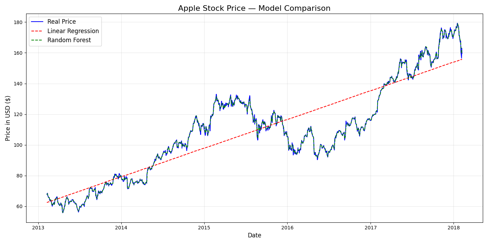
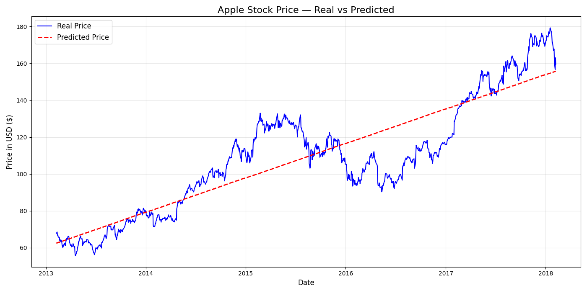

# 📈 Financial Data Predictor

A Machine Learning project that predicts Apple stock prices 
using historical S&P 500 data and Linear Regression.

---

## 🎯 Project Overview

Can a machine learn from 5 years of stock market history 
and predict future prices?

This project answers that question by applying Machine Learning 
to real financial data from the S&P 500 index covering 2013–2018.

This project builds on my research in ML-based financial 
forecasting presented at an HEC-organized National Conference in 2023.

---

## 📊 Results

| Metric | Linear Regression | Random Forest |
|---|---|---|
| R2 Score | 0.7664 (76.6%) | 0.9984 (99.8%) |
| Mean Absolute Error | $11.67 | $0.89 |
| Training Data | 1,007 days | 1,007 days |
| Testing Data | 252 days | 252 days |

> Random Forest outperformed Linear Regression significantly,
> achieving **99.84% accuracy** with only **$0.89 average error.**

---

## 📉 Model Comparison — Real vs Predicted



*Blue = Real Price | Red = Linear Regression | Green = Random Forest*

## 📉 Real Price vs Predicted Price



*Blue line = Real Price | Red dotted line = Predicted Price*

---

## 🛠️ Tech Stack

- **Python** — Core programming language
- **Pandas** — Data loading and cleaning
- **Scikit-learn** — Machine Learning model
- **Matplotlib** — Data visualization

---

## 📁 Project Structure
financial-data-predictor/
│
├── predictor.py          # Main ML pipeline
├── all_stocks_5yr.csv    # Raw S&P 500 dataset
├── apple_clean.csv       # Cleaned Apple data
├── apple_prediction.png  # Result visualization
└── README.md             # Project documentation

---

## 🚀 How to Run

**1. Clone the repository**
```bash
git clone https://github.com/Muhammadfaisal39/financial-data-predictor
cd financial-data-predictor
```

**2. Install dependencies**
```bash
pip install pandas matplotlib scikit-learn
```

**3. Run the predictor**
```bash
python predictor.py
```

---

## 📚 Dataset

- **Source:** S&P 500 Stock Data — Kaggle
- **Size:** 619,040 rows across 500 companies
- **Period:** 2013 — 2018
- **Features:** Date, Open, High, Low, Close, Volume

---

## 🔮 Future Improvements

- Add LSTM Neural Network for time-series specific predictions
- Predict multiple stocks simultaneously
- Build an interactive dashboard with real-time data
- Include sentiment analysis from financial news
- Deploy as a web application
---

## 👨‍💻 About the Author

**Muhammad Faisal**
CS Graduate | ML Researcher | Software Engineer

- 🎓 CGPA: 3.87/4.0 — Hazara University Mansehra
- 📝 Presented ML research at HEC National Conference 2023
- 🏆 IBM Machine Learning with Python — Coursera 2026
- 💼 [LinkedIn](https://www.linkedin.com/in/muhammadfaisal39)
- 🐙 [GitHub](https://github.com/Muhammadfaisal39)

---

⭐ If you found this project useful, please give it a star!
